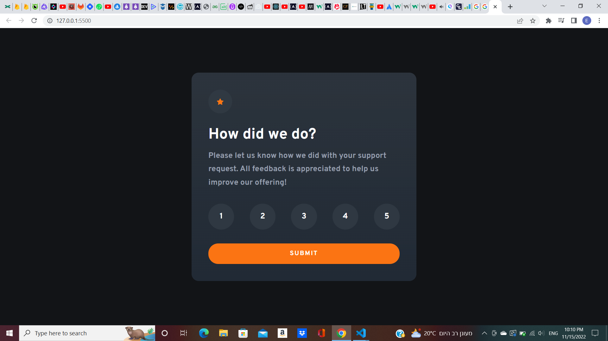

# Frontend Mentor - Interactive rating component solution

This is a solution to the [Interactive rating component challenge on Frontend Mentor](https://www.frontendmentor.io/challenges/interactive-rating-component-koxpeBUmI). Frontend Mentor challenges help you improve your coding skills by building realistic projects. 

## Table of contents

- [Overview](#overview)
  - [The challenge](#the-challenge)
  - [Screenshot](#screenshot)
  - [Links](#links)
- [My process](#my-process)
  - [Built with](#built-with)
  - [What I learned](#what-i-learned)
  - [Continued development](#continued-development)
  - [Useful resources](#useful-resources)
- [Author](#author)


## Overview

### The challenge

Users should be able to:

- View the optimal layout for the app depending on their device's screen size
- See hover states for all interactive elements on the page
- Select and submit a number rating
- See the "Thank you" card state after submitting a rating
- See reaction for the user if steps he should do has done by the wrong order

### Screenshot




### Links

- Solution URL: [https://eliyahubelay.github.io/Frontend-Mentor5/]

## My process

### Built with

- Semantic HTML5 markup
- Flexbox
- CSS Grid

### What I learned

I sharping my design skills & start play with vanilla javascript from scratch all over again :) . 


```css
.rate_number:hover{
    background-color: hsl(217, 12%, 63%);
    cursor: pointer;
}
```
```js
btn.onclick = ()=>{
    if (state == 0) {
        ratingNumbersContainer[0].style.border = "solid 1px red";
        return
    }
    let containerAllContent = document.getElementsByClassName('container_all_content');
    let container_thank_you_message = document.getElementsByClassName("container_thank_you_message");
    let userChoosenNumber = document.getElementById("userChoosenNumber");
    containerAllContent[0].classList.add("hidden");
    userChoosenNumber.innerHTML = state;
    container_thank_you_message[0].classList.remove("hidden");
};
```


### Continued development

I want to keep working more on vanilla js so I will be completely comfortable with again.

### Useful resources

- [https://www.w3schools.com/js/js_htmldom_elements.asp] - This helped me for getting the exact syntax finding HTML elements.
- [https://www.w3schools.com/jsref/dom_obj_all.asp] - Those properties and methods helped me for manipulate the HTML elements.


## Author

- Website - Will be one soon
- Frontend Mentor - [https://www.frontendmentor.io/profile/EliyahuBelay]
- Twitter - [https://twitter.com/eliyahu_belay]

